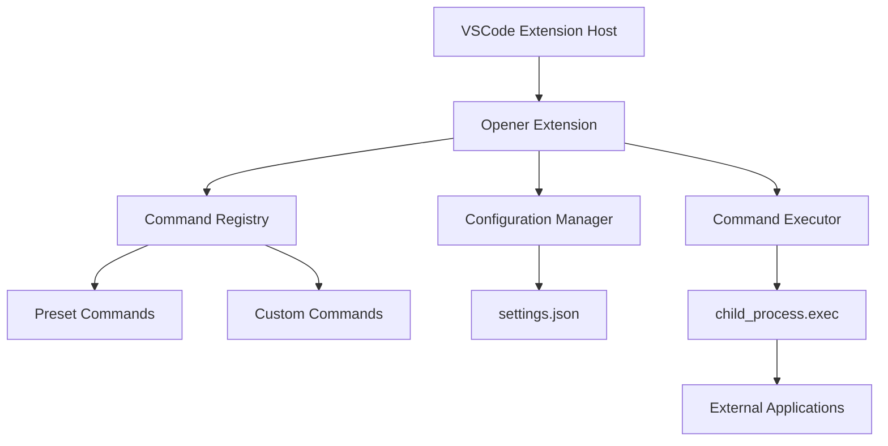
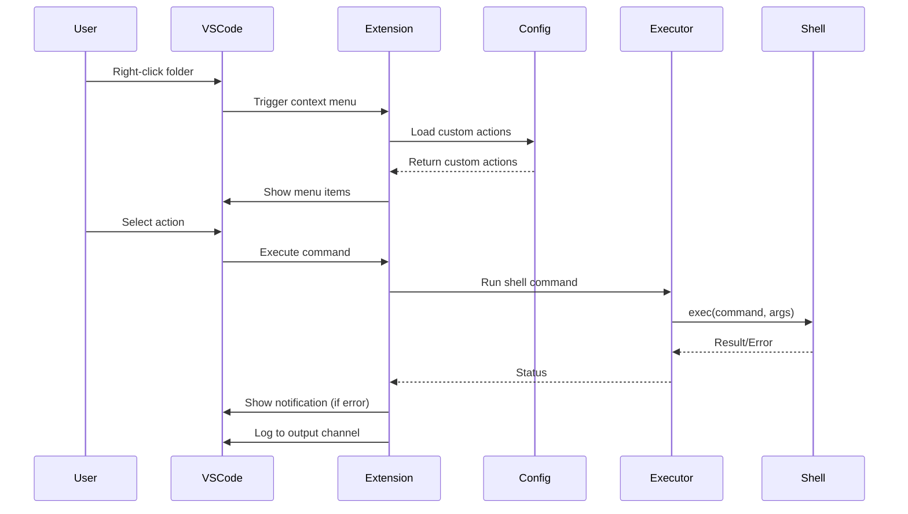

# Design Document

## Overview

The opener extension is a VSCode extension that enhances the Explorer context menu with quick-access actions for opening folders in external applications. The extension uses VSCode's contribution points system to register commands and menu items, and leverages Node.js child_process to execute shell commands.

The architecture follows VSCode extension best practices with a single activation point, command registration, and configuration-driven behavior for extensibility.

## Architecture

### High-Level Architecture



### Component Interaction Flow



## Components and Interfaces

### 1. Extension Activation (extension.ts)

**Responsibilities:**

- Register all commands during activation
- Load custom folder actions from configuration
- Create output channel for logging
- Set up command handlers

**Key Functions:**

```typescript
export function activate(context: vscode.ExtensionContext): void;
export function deactivate(): void;
```

**Activation Sequence:**

1. Create output channel named "Opener"
2. Register preset commands (openXcode, openAndroidStudio, openCurrentWindow, openNewWindow)
3. Load custom actions from workspace configuration
4. Register dynamic commands for each custom action
5. Add all disposables to context.subscriptions

### 2. Configuration Manager

**Responsibilities:**

- Read and parse opener.customFolders from settings
- Validate custom action structure
- Provide type-safe access to configuration

**Interface:**

```typescript
interface CustomFolderAction {
  folderName: string;
  label: string;
  command: string;
  args: string[];
}

function getCustomActions(): CustomFolderAction[];
function validateCustomAction(action: any): boolean;
```

**Configuration Schema:**

```json
{
  "opener.customFolders": {
    "type": "array",
    "items": {
      "type": "object",
      "required": ["folderName", "label", "command", "args"],
      "properties": {
        "folderName": { "type": "string" },
        "label": { "type": "string" },
        "command": { "type": "string" },
        "args": { "type": "array", "items": { "type": "string" } }
      }
    }
  }
}
```

### 3. Command Executor

**Responsibilities:**

- Execute shell commands with proper error handling
- Resolve folder paths from VSCode URI
- Log command execution and results
- Show user notifications on errors

**Interface:**

```typescript
interface CommandExecutionOptions {
  command: string;
  args: string[];
  cwd: string;
  label: string;
}

async function executeCommand(options: CommandExecutionOptions): Promise<void>;
function getFolderPath(uri: vscode.Uri): string;
function logExecution(
  command: string,
  cwd: string,
  success: boolean,
  error?: string
): void;
```

**Execution Flow:**

1. Receive command and folder URI from VSCode
2. Resolve absolute folder path
3. Build full command string with arguments
4. Execute using child_process.exec with cwd set to folder path
5. Log result to output channel
6. Show error notification if command fails

### 4. Command Registry

**Responsibilities:**

- Register all VSCode commands
- Map command IDs to handlers
- Handle command execution context

**Preset Commands:**

| Command ID               | Label                        | Condition                | Shell Command                |
| ------------------------ | ---------------------------- | ------------------------ | ---------------------------- |
| opener.openXcode         | 🧩 Open in Xcode             | Folder name == "ios"     | `open -a Xcode .`            |
| opener.openAndroidStudio | 🤖 Open in Android Studio    | Folder name == "android" | `open -a "Android Studio" .` |
| opener.openCurrentWindow | 💠 Open here in VSCode       | Any folder               | `code .`                     |
| opener.openNewWindow     | 💠 Open in new VSCode window | Any folder               | `code -n .`                  |

**Custom Commands:**

- Dynamically registered based on configuration
- Command ID format: `opener.custom.{index}`
- Menu visibility controlled by folder name matching

## Data Models

### CustomFolderAction

```typescript
interface CustomFolderAction {
  folderName: string; // Folder name to match (e.g., "server", "backend")
  label: string; // Display label in context menu
  command: string; // Shell command to execute (e.g., "open")
  args: string[]; // Command arguments (e.g., ["-a", "iTerm.app", "."])
}
```

### CommandContext

```typescript
interface CommandContext {
  uri: vscode.Uri; // Folder URI from context menu
  folderPath: string; // Resolved absolute path
  folderName: string; // Base name of folder
}
```

## Error Handling

### Error Categories

1. **Configuration Errors**

   - Invalid custom action structure
   - Missing required properties
   - **Handling:** Log warning, skip invalid action, continue with valid actions

2. **Command Execution Errors**

   - Application not found
   - Permission denied
   - Invalid path
   - **Handling:** Show error notification, log detailed error to output channel

3. **Path Resolution Errors**
   - Invalid URI
   - Folder doesn't exist
   - **Handling:** Show error notification, log error

### Error Notification Format

```
Failed to execute: {label}
Command: {full command}
Error: {error message}
```

### Logging Strategy

- **Info Level:** Successful command executions
- **Warning Level:** Invalid configuration entries
- **Error Level:** Command execution failures

**Log Format:**

```
[INFO] Executed: open -a Xcode . (cwd: /path/to/ios)
[ERROR] Failed to execute: open -a Xcode . (cwd: /path/to/ios) - Error: Application not found
[WARN] Invalid custom action: missing 'command' property
```

## Testing Strategy

### Unit Testing Approach

**Test Framework:** VSCode Extension Test Runner with Mocha

**Test Categories:**

1. **Configuration Tests**

   - Valid custom action parsing
   - Invalid custom action handling
   - Empty configuration handling
   - Multiple custom actions

2. **Command Registration Tests**

   - All preset commands registered
   - Custom commands dynamically registered
   - Command IDs are unique

3. **Path Resolution Tests**

   - Valid folder URI to path conversion
   - Folder name extraction
   - Edge cases (root folders, special characters)

4. **Command Execution Tests (Mocked)**
   - Successful execution flow
   - Error handling and notification
   - Logging behavior
   - Working directory set correctly

### Integration Testing Approach

**Manual Testing Checklist:**

1. Right-click "ios" folder → verify "Open in Xcode" appears
2. Right-click "android" folder → verify "Open in Android Studio" appears
3. Right-click any folder → verify VSCode window options appear
4. Right-click file → verify no opener actions appear
5. Add custom action in settings → verify it appears for matching folder
6. Execute each action → verify correct application opens
7. Execute action with invalid command → verify error notification
8. Check output channel → verify logs are present

### Test Data

**Sample Custom Configuration:**

```json
{
  "opener.customFolders": [
    {
      "folderName": "server",
      "label": "Open Backend Terminal",
      "command": "open",
      "args": ["-a", "iTerm.app", "."]
    },
    {
      "folderName": "docs",
      "label": "Open in Typora",
      "command": "open",
      "args": ["-a", "Typora", "."]
    }
  ]
}
```

## Implementation Notes

### VSCode API Usage

- **vscode.commands.registerCommand:** Register command handlers
- **vscode.workspace.getConfiguration:** Access user settings
- **vscode.window.showErrorMessage:** Display error notifications
- **vscode.window.createOutputChannel:** Create logging channel
- **vscode.Uri.fsPath:** Convert URI to file system path

### Menu Contribution Strategy

Use `when` clauses in package.json to control menu visibility:

```json
{
  "command": "opener.openXcode",
  "when": "explorerResourceIsFolder && resourceFilename == ios",
  "group": "navigation@1"
}
```

**Note:** VSCode's `when` clause has limitations for dynamic folder name matching. For custom actions, we'll need to:

1. Register commands for all custom actions
2. Use a generic `when` clause (explorerResourceIsFolder)
3. Filter visibility programmatically or accept that all custom commands appear for all folders

**Alternative Approach:** Use command visibility API or submenu grouping to organize custom actions.

### Platform Considerations

**Current Design (macOS):**

- Uses `open -a` command for launching applications
- Application names are macOS-specific

**Future Platform Support:**

- Windows: Use `start` command or direct .exe paths
- Linux: Use `xdg-open` or application-specific commands
- Detect platform using `process.platform`
- Adjust commands accordingly

### Performance Considerations

- Extension activates on `onStartupFinished` to avoid blocking startup
- Configuration loaded once during activation
- Commands registered synchronously
- Command execution is asynchronous (doesn't block UI)
- No file system watchers or continuous polling

## File Structure

```
opener/
├── package.json              # Extension manifest and contributions
├── tsconfig.json            # TypeScript configuration
├── src/
│   └── extension.ts         # Main extension code
├── media/
│   └── icon.png            # Extension icon (128x128)
├── README.md               # User documentation
├── CHANGELOG.md            # Version history
├── .vscodeignore          # Files to exclude from package
└── node_modules/          # Dependencies
```

### package.json Structure

**Key Sections:**

- `name`: "opener"
- `displayName`: "Opener - Quick Folder Actions"
- `description`: "Open folders in external applications from context menu"
- `version`: "0.0.1"
- `engines`: VSCode version compatibility
- `categories`: ["Other"]
- `activationEvents`: ["onStartupFinished"]
- `main`: "./out/extension.js"
- `contributes`: Commands, menus, configuration
- `scripts`: Compile, watch, package
- `devDependencies`: TypeScript, VSCode types, vsce

### TypeScript Configuration

```json
{
  "compilerOptions": {
    "module": "commonjs",
    "target": "ES2020",
    "outDir": "out",
    "lib": ["ES2020"],
    "sourceMap": true,
    "rootDir": "src",
    "strict": true
  },
  "exclude": ["node_modules", ".vscode-test"]
}
```

## Security Considerations

1. **Command Injection Prevention**

   - Do not concatenate user input directly into shell commands
   - Use child_process.exec with separate args array when possible
   - Validate folder paths before execution

2. **Configuration Validation**

   - Validate all custom action properties
   - Reject actions with suspicious command patterns
   - Log warnings for potentially unsafe configurations

3. **Path Traversal Prevention**
   - Use VSCode's URI resolution
   - Validate that resolved paths are within workspace
   - Don't allow arbitrary path execution

## Extension Packaging

**Build Process:**

1. Compile TypeScript: `tsc -p ./`
2. Run tests: `npm test`
3. Package extension: `vsce package`
4. Output: `opener-0.0.1.vsix`

**Installation:**

```bash
code --install-extension opener-0.0.1.vsix
```

**Publishing (Future):**

```bash
vsce publish
```

## Future Enhancements

1. **GUI Settings Page**

   - Webview-based configuration UI
   - Add/edit/delete custom actions without editing JSON

2. **Icon Pack System**

   - Allow users to choose icon sets
   - Support custom icons for actions

3. **Cross-Platform Support**

   - Detect OS and adjust commands
   - Provide platform-specific presets

4. **Command History**

   - Track recently executed commands
   - Quick re-run from command palette

5. **Workspace Folder Support**
   - Handle multi-root workspaces
   - Allow folder-specific configurations
